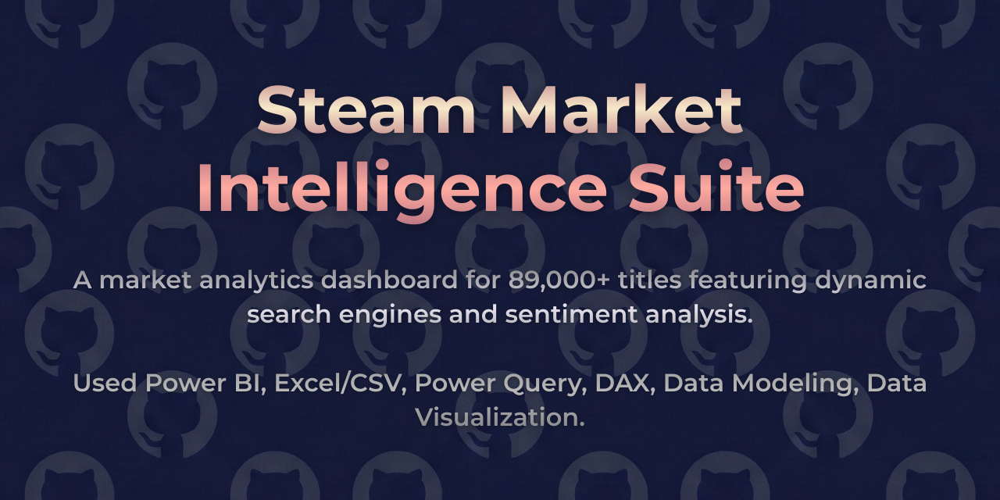
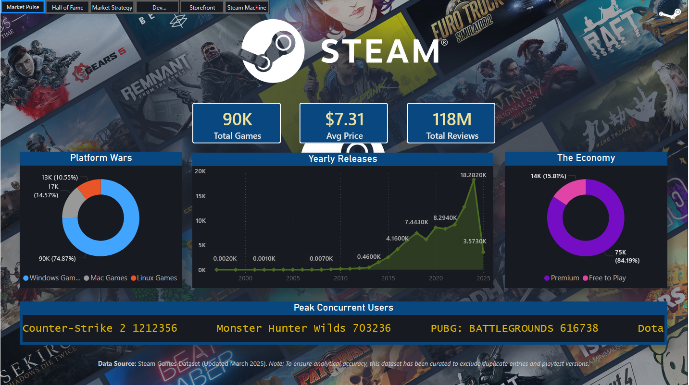
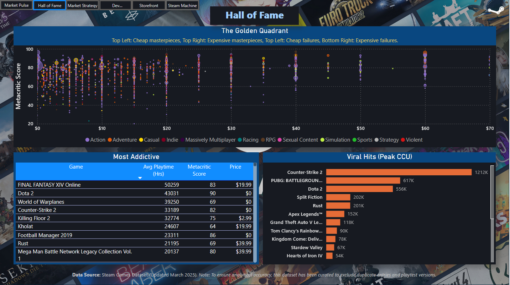
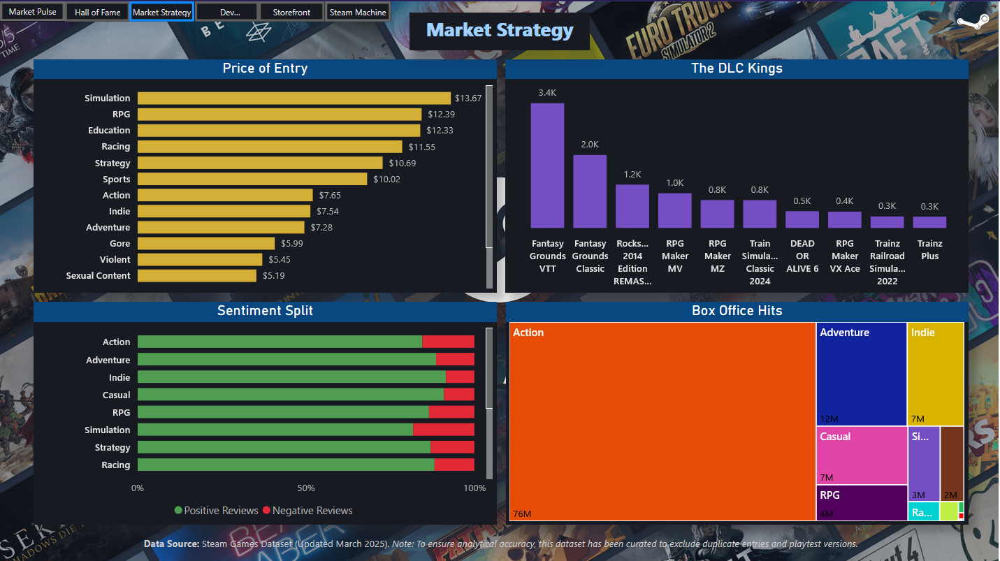
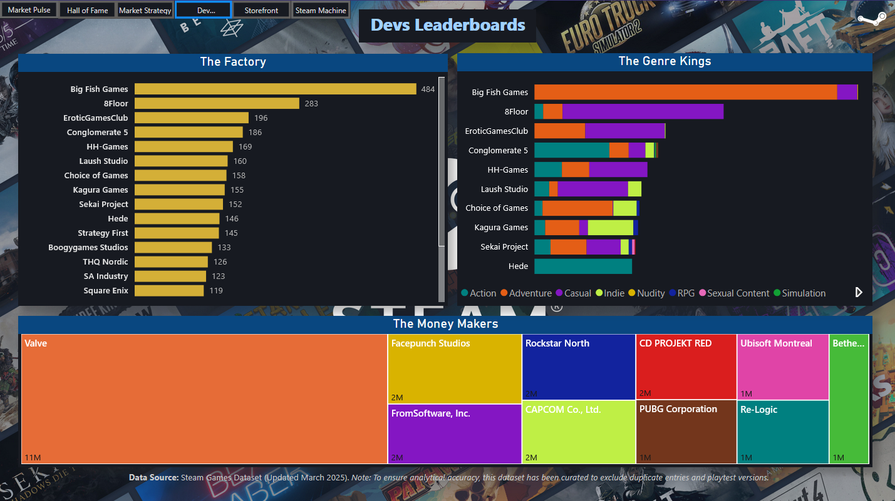
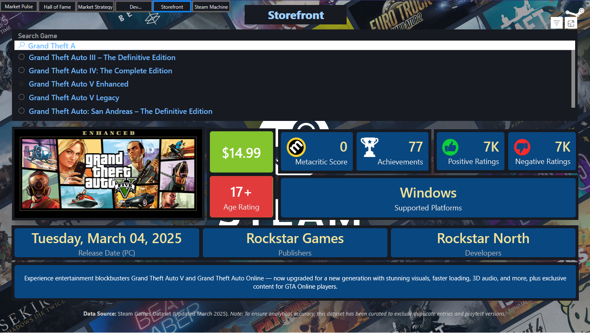
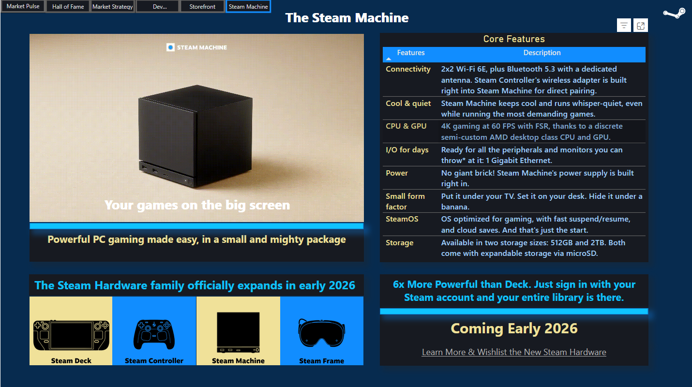

<p align="center">
  
</p>

# 🎮 Steam Market Intelligence Suite
### Gaming Industry Analytics & Platform Strategy Dashboard (Power BI)

> Market Pulse • Developer Intelligence • Storefront Deep Dive • Hardware Strategy  
> Built using the Steam Games Dataset (March 2025)

## 📌 Project Overview

**Steam Market Intelligence Suite** is a full-scale gaming industry analytics platform built using the Steam Games Dataset (March 2025 edition).

This dashboard transforms marketplace data into strategic intelligence across:

- Platform distribution  
- Pricing strategy  
- Genre economics  
- Developer dominance  
- Sentiment analysis  
- Storefront-level product analytics  
- Steam hardware ecosystem positioning  

It simulates a real-world **Gaming Market Intelligence & Product Strategy environment**.

## 📷 Dashboard Preview

### 🟦 Market Pulse


### 🟦 Hall of Fame


### 🟦 Market Strategy


### 🟦 Developer Leaderboards


### 🟦 Storefront Intelligence


### 🟦 Steam Machine Strategy


<details>
<summary>🎥 View Interactive Demo</summary>


</details>

## 🎯 Problem Statement

The Steam marketplace hosts 90K+ games across multiple genres, price segments, and developer ecosystems.

This project answers:

- How is the Steam economy structured (Premium vs Free-to-Play)?
- Which genres dominate pricing and revenue?
- Who are the most productive developers?
- Which games drive peak concurrent user traffic?
- How does price relate to review sentiment?
- What is the platform distribution across Windows, macOS, and Linux?
- How does Steam’s hardware strategy fit into its ecosystem?

## 📊 Dashboard Structure

### 🟦 Market Pulse
- Total Games
- Average Price
- Total Reviews
- Platform Wars (Windows vs Mac vs Linux)
- Yearly Releases Trend
- Premium vs Free Economy Split
- Peak Concurrent Users

### 🟦 Hall of Fame
- Golden Quadrant (Price vs Metacritic)
- Most Addictive (Avg Playtime Leaderboard)
- Viral Hits (Peak CCU Ranking)

### 🟦 Market Strategy
- Price of Entry by Genre
- DLC Kings
- Sentiment Split
- Box Office Hits (Revenue Treemap)

### 🟦 Developer Leaderboards
- The Factory (Most Games Published)
- Genre Kings
- The Money Makers

### 🟦 Storefront Intelligence
Interactive game-level analytics including:

- Price
- Metacritic Score
- Achievements
- Ratings Breakdown
- Release Date
- Developer & Publisher
- Supported Platforms
- Age Rating

### 🟦 Steam Machine Strategy
- Steam Hardware Overview
- Feature Breakdown
- Ecosystem Expansion Outlook

## 🛠 Tools & Technologies

- Power BI Desktop  
- Power Query (Data Cleaning & Transformation)  
- DAX (Calculated Measures & Conditional Logic)  
- Star Schema Data Modeling  
- Interactive Slicers & Drill-Through  

## 🧩 Data Modeling Approach

The dashboard follows a **Star Schema design**.

**Fact Table**
- Games Dataset (Pricing, Reviews, Platform Support, Scores)

**Dimension Attributes**
- Genre  
- Developer  
- Publisher  
- Platform  
- Release Year  
- Game Type  

The model is optimized for:

- Cross-filtering  
- Developer benchmarking  
- Platform segmentation  
- Sentiment analysis  
- Revenue visualization  

> ⚙️ Model Optimization Note  
> The initial model size was 267MB due to high-cardinality descriptive fields (long text, HTML content, media metadata).  
> By removing unused columns and optimizing the fact table structure, the final PBIX size was reduced to 26MB, significantly improving performance and portability.

## 📊 Key Metrics Implemented

- Total Games  
- Total Reviews  
- Average Price  
- Platform Distribution  
- Free vs Premium Classification  
- Age Rating Classification  
- Supported Platform Logic  

Full DAX documentation is available in:

```
Scripts/DAX-Measures.md
```

## 📂 Data Source

Steam Games Dataset (March 2025)  
Source: Kaggle  
https://www.kaggle.com/datasets/artermiloff/steam-games-dataset  

> Raw dataset files are not redistributed in this repository.

## 💡 Business Value

This dashboard enables:

- Gaming market benchmarking  
- Genre-level pricing strategy analysis  
- Developer ecosystem evaluation  
- Revenue segmentation insights  
- Sentiment-driven performance evaluation  
- Platform strategy assessment  
- Product-level competitive intelligence  

It demonstrates capabilities aligned with:

- Gaming Industry Analyst  
- Product Strategy Analyst  
- Market Intelligence Analyst  
- Business Intelligence Developer  

## 📁 Repository Structure
- Assets contain Dashboard Visuals, Complete Walkthrough PDF and Repository Banner / Social Media Preview Image.
- Datasets contain Dataset References (no raw data included).
- Scripts contain DAX Documentation.
- *Steam Market Intelligence Suite.pbix* is the Complete Interactive Power BI Dashboard.
  
```text
Steam-Market-Intelligence-Suite/
│
├── Assets/
│   ├── 1-Market-Pulse.png
│   ├── 2-Hall-of-Fame.png
│   ├── 3-Market-Strategy.png
│   ├── 4-Developer-Leaderboards.png
│   ├── 5-Storefront.png
│   ├── 6-Steam-Machine.png
│   ├── 7-Steam-Market-Intelligence-Suite-Complete-Walkthrough.png
│   ├── 8.1-Steam-Market-Intelligence-Suite-Banner.png
│   └── 8.2-Steam-Market-Intelligence-Suite-Social-Preview.png
│
├── Datasets/
│   └── Data-Sources.md
│
├── Scripts/
│   └── DAX-Measures.md
│
├── Steam Market Intelligence Suite.pbix
│
└── README.md
```

## 👤 Author

**Aryan Deshpande**  
> Aspiring Data Analyst
